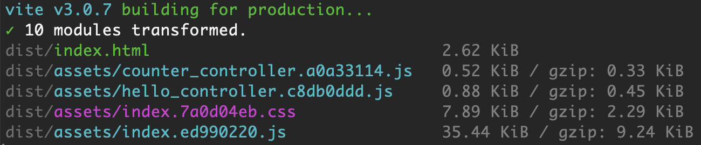

# Vite + Tailwind + Stimulus Starter


Simple project template for Vite with Tailwind CSS and Stimulus, based off of the vanilla template in [create-vite](https://github.com/vitejs/vite/tree/main/packages/create-vite). Includes HMR for stimulus controllers, and controller based code splitting for production builds.



```
# npm || yarn || pnpm
npm install
npm dev
npm build
npm preview
```
